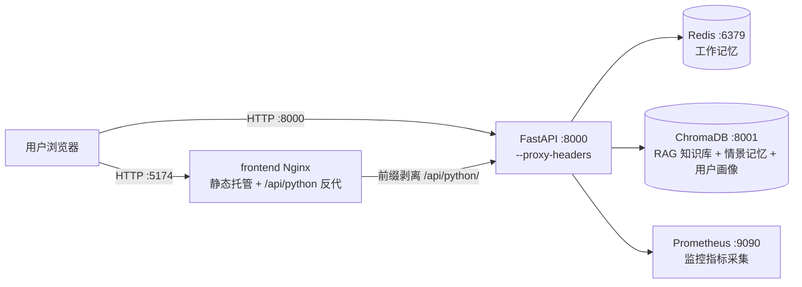
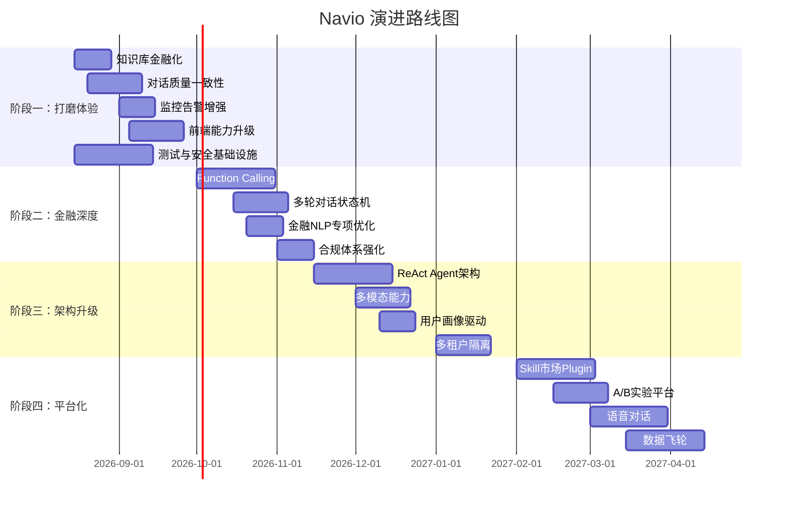

# Navio 金融产品优化蓝图（Blueprint）

> 本文档规划 Navio 从 1.0 到 2.0+ 的演进路线，按优先级和依赖关系分为四个阶段。每个增强方向都包含了「现状 → 目标 → 方案 → 收益」的结构。

---

## 当前架构基线（v1.0）

> 所有后续阶段的优化都建立在以下架构之上。了解基线有助于判断每个改进的落点。

### 运行时架构



### 基线要点

| 维度 | 现状（v1.0） | 对蓝图的影响 |
|---|---|---|
| 编排 | 仓库根目录**单一 compose**，5 容器一键启动 | 后续新增服务（如向量重排、日志采集）直接加 service 即可 |
| 入口 | 前端 Nginx 统一入口（UI + API 反代），后端 8000 直连 | 阶段四的语音/WebSocket 可挂在同一 Nginx 上 |
| Agent | 三 Agent 路由式协作（Router 模式），每次请求由单一 Agent 处理 | 阶段三 ReAct/Plan-and-Execute 将升级为真正的 Agent 间协作 |
| 意图 | 15 种金融意图，LLM + Pattern + Embedding 三源融合 | 阶段二金融 NLP 专项在此基础上扩充 Pattern 库 |
| 记忆 | 三级记忆：Redis 工作 + ChromaDB 情景 + 用户画像 | 阶段三用户画像驱动个性化直接复用现有画像写入链路 |
| 合规 | 合规红线内嵌于 Skills 与 system prompt | 阶段二 ComplianceEngine 将规则结构化、可审计 |
| 工具 | MCPToolManager + 熔断/缓存/查询改写/重排，仅 knowledge_search 一个工具 | 阶段二 Function Calling 在此框架上扩展金融工具集 |
| 部署 | 前端多阶段构建（Node→Nginx）；后端多阶段（含 ONNX 预热）；`deploy.sh` 管理 | 阶段一 CI/CD 流水线基于现有 Dockerfile 改造 |

---

## 阶段一：打磨核心体验（v1.1 ~ v1.3）

> 在现有架构基础上补齐短板、提升鲁棒性。本阶段的改进不需要重构核心架构。

### 1.1 知识库金融化

**现状**：默认知识库内容偏通用客服场景（退款政策、订单查询、会员积分），与金融产品定位不匹配。

**目标**：知识库内容覆盖真实金融产品场景。

**方案**：
- 替换默认 `_load_default_docs()` 为金融领域文档包：
  - 典型理财产品说明书模板（含数据结构化：年化收益区间、风险等级 R1-R5、锁定期、起购金额）
  - 基金费率表（申购/赎回/管理/托管费率）
  - LPR 历史利率数据（支持利率走势问答）
  - 常见贷款产品参数（信用卡分期费率、消费贷利率范围、房贷政策）
- 将金融文档的结构化字段（如 `product_type`、`risk_level`、`min_amount`）存入 ChromaDB metadata，实现筛选式检索
- 支持 `/knowledge/import-finance` 批量导入金融领域标准文档

**收益**：让 RAG 知识库真正服务于金融咨询场景，而非泛化的通用客服。

---

### 1.2 对话质量与一致性增强

**现状**：Agent 对同一类问题的回复缺乏一致性校验，多轮对话中可能出现矛盾回答。

**目标**：提升对话一致性、减少幻觉。

**方案**：
- 在 `MemoryContext.to_prompt_text()` 中注入上一轮 Agent 回答的关键金融数据点（产品名、利率、金额），形成"一致性锚点"
- 新增 `ConsistencyGuard` 中间件：检测当前答复中的利率/金额/风险等级与历史回答是否一致，不一致时追加校验提示
- 将 Skill prompt 中的禁止事项编码为结构化约束规则，注入 system prompt 尾部（而非混在 Skill 正文中）

**收益**：降低金融敏感数据的回答错误率，提升用户信任。

---

### 1.3 监控与告警增强

**现状**：Monitor 有基础的阈值告警和 Webhook，但告警策略单一，缺乏聚合和静默机制。

**目标**：生产可用的监控体系。

**方案**：
- **告警聚合**：同一 Agent 连续 N 次触发同一告警时合并为一条，避免告警风暴
- **静默窗口**：支持按 Agent/工具 配置告警静默期（如刚上线 5 分钟内不告警）
- **新增金融特有指标**：
  - `compliance_violation_rate`：合规红线触发率
  - `escalation_rate`：转人工比例（按意图分类）
  - `intent_confidence_distribution`：意图识别置信度分布直方图
- `/monitor` API 新增时间范围过滤和历史趋势数据

**收益**：生产环境可运维，能快速定位金融场景下的系统瓶颈。

---

### 1.4 前端能力升级

**现状**：前端是纯调试控制台，功能与真正的客户服务场景有差距。

**目标**：从调试工具进化为半生产级客服工作台。

**方案**：
- 增加 Markdown 渲染（金融回复中常见表格和列表）
- 对话中内联展示：意图标签、置信度、Agent 路由路径、知识库引用来源
- 增加"模拟用户"批量测试功能：输入一组用户消息，批量运行并对比结果
- 支持会话历史选择/切换（利用已有 `conv_id` 机制）

**收益**：运营和产品团队可以直接使用前端进行测试和验收。

---

## 阶段二：扩展金融深度（v1.4 ~ v1.6）

> 引入更多金融领域特有能力，从"信息咨询"向"智能分析"演进。

### 2.1 工具调用层（Function Calling）

**现状**：Agent 通过 system prompt + Skill + RAG 回答，但无法调用外部 API 获取实时数据。

**目标**：Agent 能自主选择并调用工具获取实时金融数据。

**方案**：
- 在 `MCPToolManager` 基础上实现完整的 function calling 循环：
  1. LLM 返回 tool_use
  2. ToolManager 执行工具
  3. 结果回传给 LLM 生成最终答复
- 新增金融工具集：
  - `get_product_detail(product_id)`：查询产品实时信息
  - `get_fund_nav(fund_code)`：基金净值查询
  - `calculate_loan(amount, rate, months)`：等额本息/等额本金计算器
  - `get_exchange_rate(currency_pair)`：实时汇率查询
  - `check_credit_card_bill(user_id)`：信用卡账单查询
- 工具注册支持 JSON Schema 参数描述，供 LLM 理解调用方式

**收益**：从静态知识库问答升级为实时互动式金融服务。

---

### 2.2 多轮对话状态机

**现状**：对话是 stateless 的——每轮独立处理，上下文仅通过记忆系统传递。缺乏对话流程控制。

**目标**：支持复杂金融业务流程的多轮引导（如风险评估问卷、贷款申请引导）。

**方案**：
- 引入 `DialogStateMachine`：
  - 定义状态节点：`IDLE → COLLECTING_INFO → VERIFYING → CONFIRMING → COMPLETED`
  - 每个节点有预期的槽位（slot）集合
  - 状态转换由意图 + 槽位填充度触发
- 示例流程——风险评估：
  1. 触发 `risk_assessment` 意图
  2. 逐轮收集：投资经验 / 风险承受能力 / 投资期限 / 资金规模
  3. 汇总后输出风险等级评估结果
- 状态持久化到 Redis（`dialog_state:{user_id}:{conv_id}`），天然支持中断恢复

**收益**：从单轮问答升级为真正的金融服务流程，支持更复杂的业务场景。

---

### 2.3 金融 NLP 专项优化

**现状**：意图识别依赖通用 LLM + 简单 Pattern + Embedding，对金融领域特有表达（如"7 日年化""LPR+浮动""等额本息"）不够敏感。

**目标**：金融意图识别准确率从当前基线提升至 95%+。

**方案**：
- 扩充 `IntentRecognizer._pattern_recognize` 的金融 Pattern 库：
  - 金额正则：识别"5 万""3.5%""1 年期"等带单位的金融数字
  - 产品代码正则：基金代码（6 位数字）、理财产品代码格式
- 引入 BGE-financial / FinBERT 等金融专用 Embedding 模型替换 ChromaDB 默认的 `all-MiniLM-L6-v2`
- 增加模糊匹配层：用户输入 → 拼音纠错 / 同义词扩展 → 再进意图识别

**收益**：金融垂直领域的识别精度显著提升，减少误路由。

---

### 2.4 合规体系强化

**现状**：合规规则散落在各 Skill 的"禁止事项"和 Agent 的 system prompt 中，缺乏统一管理。

**目标**：结构化的合规规则管理体系，支持审计追溯。

**方案**：
- 引入 `ComplianceEngine` 独立模块：
  - 合规规则用 YAML/JSON 声明式定义：
    - `type: block` → 触发后不回复，返回预设话术（如荐股）
    - `type: append` → 触发后在回复末尾自动附加提示（如风险警告）
    - `type: escalate` → 触发后自动转人工（如挂失盗刷）
  - 规则优先级和冲突解决机制
- 合规审计日志：每次合规触发记录 `user_id / intent / rule / timestamp` 到专用 ChromaDB collection
- 合规规则也走 Skill 热加载体系，运营可实时调整

**收益**：金融合规从"散落各处的提示"升级为"可管理、可审计、可追溯"的体系。

---

## 阶段三：架构升级与智能化（v1.7 ~ v2.0）

> 核心架构层面的增强，引入更先进的 Agent 架构模式和智能化能力。

### 3.1 ReAct / Plan-and-Execute Agent 架构

**现状**：Agent 是单轮 LLM 调用模式：接收 prompt → 返回 answer，缺乏推理链。

**目标**：Agent 能显式地思考、规划、执行、反思。

**方案**：
- 将 `BaseAgent._call_llm` 升级为 ReAct 循环：
  ```
  Thought → Action → Observation → Thought → ... → Final Answer
  ```
- 在 system prompt 中定义可用的 Action 类型：`knowledge_search`、`calculate`、`ask_user`、`escalate`
- 每一步的 Thought/Action/Observation 存入 `MemoryManager` 工作记忆，供后续推理和压缩
- 金融场景示例：
  ```
  用户: "我有 50 万闲钱，想买稳健理财"
  Thought: 需要了解用户的风险偏好和投资期限
  Action: ask_user("请问您期望的投资期限是多久？能接受本金波动吗？")
  Observation: 用户回复期望 1 年期，不接受本金亏损
  Thought: 1 年期 + 保本 → R1-R2 风险等级产品
  Action: knowledge_search("R1 R2 1年期理财产品 起购金额")
  Final Answer: 基于检索结果 + 合规约束生成回复
  ```

**收益**：Agent 从"反应式"升级为"推理式"，处理复杂金融咨询的准确性和可解释性大幅提升。

---

### 3.2 多模态能力

**现状**：仅支持文本输入，金融场景常见图片（交易截图、错误页面）无法处理。

**目标**：支持用户上传截图/照片，Agent 能理解视觉信息。

**方案**：
- 升级 `/chat` 接口支持 `image` 字段（base64 或 URL）
- 使用支持 Vision 的 LLM（如 Claude 3.5 Sonnet / GPT-4V）处理图片
- 适用场景：
  - 上传交易失败截图 → 提取错误码 → 触发技术排查 Skill
  - 上传对账单照片 → 识别金额/日期 → 对比系统记录
  - 上传身份证照片 → 辅助 KYC 问题解答
- 在前端增加图片拖拽/粘贴上传功能

**收益**：覆盖更多真实金融客服场景，用户不再需要手动描述视觉信息。

---

### 3.3 用户画像驱动的个性化服务

**现状**：用户画像（user_profile）仅用于 passive 注入 prompt，没有主动驱动个性化行为。

**目标**：基于用户画像主动调整对话策略和产品呈现。

**方案**：
- 在 `MemoryManager.update_profile` 中增加画像维度：
  - 风险偏好（保守 / 稳健 / 进取）
  - 产品偏好（理财产品偏好类型、常用银行）
  - 对话风格偏好（详细 / 简洁、专业术语 / 通俗解释）
- `AgentOrchestrator._build_system_prompt` 中根据画像调整：
  - 对不同风险偏好的用户，优先展示匹配风险等级的产品
  - 对话风格偏好影响回复的详细程度和术语使用
- 画像置信度：每次更新时附带置信度，低于阈值时不自动应用

**收益**：千人千面的金融服务体验，增加用户黏性和满意度。

---

### 3.4 多租户与金融场景隔离

**现状**：单个 Navio 实例服务所有用户，无法区分不同金融机构的需求。

**目标**：支持多租户部署，各租户有独立的知识库、Skills、合规规则。

**方案**：
- 引入 `tenant_id` 概念：
  - 不同租户使用不同的 ChromaDB collection：`{tenant_id}_knowledge_base`、`{tenant_id}_episodic`
  - Redis key 增加租户前缀：`tenant:{tenant_id}:wm:{user_id}:{conv_id}`
  - Skills 目录支持租户隔离：`skills/{tenant_id}/financial_products/SKILL.md`
- `/chat` 请求中增加 `tenant_id` 字段
- 管理接口：租户级别监控、租户级别知识库管理

**收益**：一份代码服务多家金融机构或业务线，降低运维成本。

---

## 阶段四：生态化与平台化（v2.1+）

> 将 Navio 从一个单体系统扩展为可插拔的 AI 助理平台。

### 4.1 开放 Skill 市场和 Plugin 机制

**目标**：允许第三方为 Navio 开发 Skills，形成生态。

**方案**：
- Skills 注册中心：标准化 Skill 的 metadata schema（name / version / author / compatibility）
- Skill 依赖声明：一个 Skill 可以声明依赖的 tools、知识库、最低 LLM 版本
- Skill 市场前端：浏览、安装、评分、评论
- Plugin 机制：通过 Python entry_points 加载第三方插件（如自定义 tool、自定义 intent）

### 4.2 A/B 实验平台

**目标**：能够同时运行多个版本的 prompt / Skill / 路由策略，对比效果。

**方案**：
- 流量分割：基于 `user_id` 哈希将请求路由到不同实验组
- 每组可配置：system prompt 变体、Skill 组合、路由策略
- 评测集成：`/eval/run` 支持指定实验组，对比各组的 intent_accuracy / relevance / accuracy
- 实验看板：前端增加 A/B 对比视图

### 4.3 实时语音对话

**目标**：从文本聊天升级为语音对话客服。

**方案**：
- WebSocket 集成语音流：前端 WebRTC → 后端 ASR（Whisper） → Navio Agent → TTS（Edge TTS / OpenAI TTS） → 前端播放
- 语音特有优化：打断机制（barge-in）、情绪识别、语速/语调控制

### 4.4 数据飞轮与分析

**目标**：从对话数据中持续学习和优化。

**方案**：
- 对话分析仪表板：
  - Top 10 高频意图分布
  - 用户满意度趋势（基于评测分数）
  - 转人工率变化
  - 知识库命中率与未覆盖话题
- 自动化数据标注：
  - 转人工的对话 → 自动提取 ↓ 哪些问题 Agent 解决不了
  - 低分评测对话 → 自动归类失败原因
- 模型微调流水线：高质量对话 → 自动生成训练数据 → 对 LLM 进行 SFT/LoRA 微调

---

## 技术债与基础设施改进

> 以下改进贯穿各阶段，随版本迭代逐步补齐。

| 类别 | 项目 | 优先级 | 阶段 |
|---|---|---|---|
| 测试 | 单元测试覆盖 `IntentRecognizer` / `MemoryManager` / `ToolManager` | 🔴 高 | 阶段一 |
| 测试 | API 集成测试（pytest + httpx） | 🔴 高 | 阶段一 |
| 测试 | 金融意图回归测试集（至少 200 条标注数据） | 🟡 中 | 阶段一 |
| 可观测性 | 结构化日志（JSON 格式，按 trace_id 串联请求链） | 🟡 中 | 阶段一 |
| 可观测性 | OpenTelemetry 链路追踪 | 🟢 低 | 阶段二 |
| 安全性 | API 鉴权（API Key / JWT） | 🔴 高 | 阶段一 |
| 安全性 | 敏感金融数据脱敏（日志中的卡号/金额/身份证） | 🔴 高 | 阶段一 |
| 安全性 | PII 扫描器：检测 LLM 回复中是否意外泄露个人信息 | 🟡 中 | 阶段二 |
| 性能 | 意图识别结果预加载（Embedding 预热） | 🟡 中 | 阶段一 |
| 性能 | LLM 调用并发限制（令牌桶 / 信号量） | 🟡 中 | 阶段二 |
| 性能 | Redis 连接池优化 + ChromaDB 批量写入 | 🟢 低 | 阶段二 |
| CI/CD | GitHub Actions 自动化测试 + Docker 镜像构建 | 🟡 中 | 阶段一 |
| CI/CD | 灰度发布策略（蓝绿部署 / Canary） | 🟢 低 | 阶段三 |

---

## 路线图总览



---

## 核心设计原则

1. **金融场景优先**：每个功能都从真实的金融客服场景出发，不为了技术炫技而做无意义的功能。
2. **合规不可妥协**：任何涉及合规红线的优化都必须是"增强"而非"削弱"，合规审查是每个 feature 的 gate。
3. **渐进式演进**：避免大爆炸式重构，优先在现有架构上做增量改进，架构升级要有明确的收益论证。
4. **可观测驱动**：所有的优化决策都应基于监控数据和评测指标，而不是直觉。
5. **开发者友好**：Skills 热加载、Docker 一键部署、丰富的文档——降低维护门槛就是降低长期成本。
