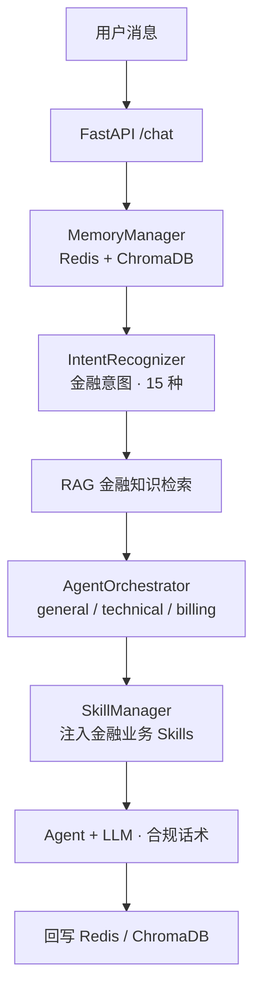

# Navio 金融产品咨询 Agent

基于 **Python FastAPI + Vue 3 + LLM** 的多 Agent 金融产品咨询系统，覆盖理财产品、基金、存款、贷款、信用卡等场景，支持意图识别、智能路由、RAG 知识库和合规话术。

## ✨ 核心能力

- **金融多 Agent 编排**：`general`（综合金融顾问）/ `technical`（系统技术支持）/ `billing`（账户与费用专员），按意图自动路由
- **15 种金融意图识别**：涵盖理财查询、基金净值、存款利率、贷款/信用卡、还款、挂失盗刷、开户 KYC、风险评估、投资建议等，LLM + Pattern + Embedding 三源融合
- **合规红线内嵌**：禁止荐股推荐、禁止承诺收益、强制风险提示、挂失盗刷自动转人工
- **RAG 金融知识库**：ChromaDB 向量检索 + 查询改写 + 重排，支持理财产品说明书、基金费率、贷款参数等实时导入
- **三级记忆**：Redis 工作记忆 + ChromaDB 情景记忆 + 用户画像，对话超阈值自动压缩
- **Skills 热加载**：`SKILL.md` 即改即生效，三套金融业务规范（综合咨询、技术支持、账户服务）
- **在线监控**：`/monitor` 展示 Agent 调用量与成功率，Prometheus 指标采集
- **端到端评测**：`/eval/run` LLM-as-Judge 评测意图准确率与对话质量

### 意图体系

| 意图 | 说明 | 路由 Agent |
|---|---|---|
| `financial_product` | 理财产品查询 | general |
| `fund` | 基金查询 | general |
| `deposit` | 存款查询 | general |
| `loan` | 贷款查询 | billing |
| `credit_card` | 信用卡查询 | billing |
| `repayment` | 还款查询 | billing |
| `fee_dispute` | 费用异议 | billing |
| `card_loss` | 挂失盗刷 | billing（强制升级） |
| `kyc` | 开户/实名认证 | billing |
| `risk_assessment` | 风险评估 | general |
| `investment_advice` | 投资建议 | general（合规拦截） |
| `technical_login` | 登录故障 | technical |
| `technical_crash` | 系统报错 | technical |
| `human_handoff` | 转人工 | escalation |
| `greeting` | 问候 | general |

## 📁 项目结构

```
Navio/                         # Python FastAPI 后端
├── api/main.py                # /chat /search /knowledge /monitor /eval/run
├── agents/agent_orchestrator.py  # 多 Agent 编排 + 金融路由表
├── core/intent_recognizer.py  # 意图识别（15 种金融意图 + Pattern 规则）
├── core/skill_loader.py       # Skills 动态加载
├── core/llm_utils.py          # LLM 响应提取工具
├── memory/conversation_memory.py  # 三级记忆
├── mcp/                       # 工具管理 + ChromaDB 知识库
├── monitor/performance_monitor.py  # 性能监控
├── evaluation/evaluator.py    # LLM-as-Judge 评测
├── skills/                    # 金融业务 Skills（可热加载）
│   ├── financial_products/SKILL.md   # 综合金融咨询规范
│   ├── tech_support/SKILL.md         # 金融系统技术规范
│   └── account_services/SKILL.md     # 账户与费用服务规范
├── config/                    # Nginx + Prometheus 配置
└── docker-compose.yml         # 5 服务全栈编排

NavioFrontend/                 # Vue 3 前端
├── src/App.vue                # 聊天调试、知识库检索、知识导入
└── src/lib/backends.js        # API 封装
```

## 🚀 快速开始

### 前置条件

- Docker + Docker Compose
- LLM API Key：Anthropic 官方 Key，或兼容 Anthropic 协议的第三方 Key（如 DeepSeek）

### 1. 配置

```bash
cd Navio
cp .env.example .env
```

`.env` 配置（DeepSeek 示例）：

```env
ANTHROPIC_BASE_URL=https://api.deepseek.com/anthropic
ANTHROPIC_MODEL=deepseek-v4-pro
ANTHROPIC_API_KEY=your_deepseek_key
```

### 2. 启动

```bash
docker compose up -d --build          # 后端 5 服务
cd ../NavioFrontend
npm install && npm run build
docker compose up -d --build          # 前端容器
```

| 服务 | 端口 | 用途 |
|---|---|---|
| navio-app | 8000 | FastAPI 主应用 |
| navio-nginx | 80 | 反向代理 |
| navio-chromadb | 8001 | 向量数据库 |
| navio-redis | 6379 | 工作记忆 |
| navio-prometheus | 9090 | 监控 |
| navio-frontend | 5174 | 前端界面 |

### 3. 验证

```bash
curl http://localhost:8000/health   # {"status":"ok",...}
```

- Swagger 文档：http://localhost:8000/docs
- 前端聊天台：**http://localhost:5174**

## 💬 使用示例

```bash
# 理财产品查询 → 路由到 general
curl -X POST http://localhost:8000/chat \
  -H "Content-Type: application/json" \
  -d '{"message":"这款理财的年化收益是多少？风险等级是什么？","user_id":"u1001"}'

# 信用卡账单 → 路由到 billing
curl -X POST http://localhost:8000/chat \
  -d '{"message":"我的信用卡账单能分期吗？','user_id":"u1001"}'

# 挂失盗刷 → 自动转人工
curl -X POST http://localhost:8000/chat \
  -d '{"message":"我的卡被盗刷了!",'user_id":"u1001"}'
```

返回字段：`intent` / `primary_agent` / `routing_confidence` / `knowledge_used` / `escalated`

## 🧠 系统架构



## 🧪 评测

```bash
curl -X POST http://localhost:8000/eval/run \
  -H "Content-Type: application/json" \
  -d '{"intent_cases":[{"message":"这款理财收益多少?","expected_intent":"financial_product"}]}'
```

## 📄 文档

- [CHANGELOG.md](CHANGELOG.md)
- 后端完整指南：[`Navio/README.md`](Navio/README.md)
