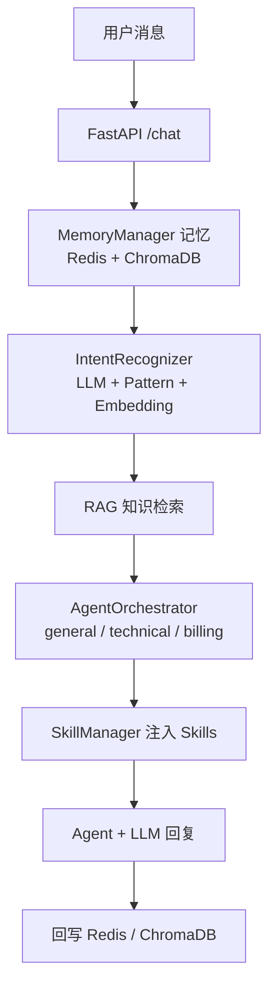

# Navio 智能客服系统

基于 **Python FastAPI + Vue 3** 的多 Agent 智能客服系统，支持意图识别、多 Agent 路由、RAG 知识库、三级记忆和端到端评测，可通过 Docker Compose 一键部署。

## ✨ 核心能力

- **多 Agent 编排**：`general`（通用客服）/ `technical`（技术支持）/ `billing`（账单服务），按意图自动路由，支持复合问题的多 Agent 协同
- **意图识别**：LLM + 规则 Pattern + Embedding 三源融合打分，附带置信度
- **RAG 知识库**：ChromaDB 向量检索 + 查询改写 + 重排，业务知识实时可更新
- **三级记忆**：Redis 工作记忆（最近对话）+ ChromaDB 情景记忆（会话摘要）+ 用户画像，超过阈值自动压缩
- **Skills 动态加载**：`SKILL.md` 热加载，随时更新 Agent 话术与业务流程，无需重启
- **在线监控**：`/monitor` 展示 Agent 调用量、成功率、耗时与熔断状态，Prometheus 指标采集
- **端到端评测**：`/eval/run` 用 LLM-as-Judge 评测意图准确率与对话质量，输出回归与改进建议
- **转人工判定**：自动检测升级场景（`escalated`）

## 📁 项目结构

```
Navio/                    # Python FastAPI 后端
├── api/main.py           # FastAPI 入口：/chat /search /knowledge/* /monitor /eval/run
├── agents/               # AgentOrchestrator 多 Agent 编排（general/technical/billing）
├── core/                 # 意图识别、Skill 加载、LLM 工具
├── memory/               # 三级记忆：Redis 工作记忆 + ChromaDB 情景记忆 + 用户画像
├── mcp/                  # 工具管理、知识库（RAG）
├── monitor/              # 性能监控与告警
├── evaluation/           # 端到端评测（LLM-as-Judge）
├── skills/               # 业务 Skills（SKILL.md，可热加载）
├── config/               # Nginx 反向代理、Prometheus 配置
└── docker-compose.yml    # 后端全栈编排：app + redis + chromadb + prometheus + nginx

NavioFrontend/            # Vue 3 前端（聊天调试台）
├── src/App.vue           # 聊天、知识库检索、知识导入界面
├── src/lib/backends.js   # 后端 API 封装
└── vite.config.js        # Vite 代理配置
```

## 🚀 快速开始

### 前置条件

- Docker + Docker Compose
- LLM API Key：Anthropic 官方 Key，或兼容 Anthropic 协议的第三方 Key（如 DeepSeek）

### 1. 配置环境变量

```bash
cd Navio
cp .env.example .env
```

`.env` 最少配置：

```env
ANTHROPIC_API_KEY=your_api_key
```

使用 DeepSeek 兼容接口：

```env
ANTHROPIC_BASE_URL=https://api.deepseek.com/anthropic
ANTHROPIC_MODEL=deepseek-v4-pro
ANTHROPIC_API_KEY=your_deepseek_key
```

### 2. 启动后端（Docker Compose 全栈）

```bash
docker compose up -d --build
```

启动 5 个服务：

| 服务 | 端口 | 用途 |
|------|------|------|
| navio-app | 8000 | FastAPI 主应用 |
| navio-nginx | 80 | 反向代理 |
| navio-chromadb | 8001 | 向量数据库 |
| navio-redis | 6379 | 工作记忆 |
| navio-prometheus | 9090 | 监控指标 |

验证：

```bash
curl http://localhost:8000/health   # {"status":"ok",...}
```

Swagger 文档：http://localhost:8000/docs

### 3. 启动前端（可选）

```bash
cd NavioFrontend
npm install
npm run dev          # 开发模式 → http://localhost:5173
# 或 Docker 部署：npm run build && docker compose up -d --build → http://localhost:5174
```

## 💬 使用示例

```bash
curl -X POST http://localhost:8000/chat \
  -H "Content-Type: application/json" \
  -d '{"message": "我想申请退款，订单号 #12345", "user_id": "u1001", "conv_id": "c001"}'
```

返回关键字段：`intent`（意图）、`primary_agent`（路由 Agent）、`routing_confidence`（置信度）、`knowledge_used`（是否用知识库）、`escalated`（是否转人工）。

### 常用 API

| 接口 | 说明 |
|------|------|
| `POST /chat` | 主对话接口 |
| `POST /search?query=&top_k=` | 知识库检索 |
| `POST /knowledge/add` | JSON 批量导入知识 |
| `POST /knowledge/upload` | 上传文件（.txt/.md/.json） |
| `GET /knowledge/stats` | 知识库统计 |
| `GET /monitor` | Agent/工具监控 |
| `GET /skills` / `POST /skills/reload` | Skills 查看/热加载 |
| `POST /eval/run` | 端到端评测 |
| `GET /metrics` | Prometheus 指标 |

## 🧠 系统架构



## 🧪 评测

```bash
curl -X POST http://localhost:8000/eval/run \
  -H "Content-Type: application/json" \
  -d '{"intent_cases": [{"message": "我要退款", "expected_intent": "billing_refund"}], "dialog_cases": []}'
```

输出 `pass_rate`、`avg_scores`（意图准确率/相关性/准确性/完整性/有用性）、`regressions` 与 `recommendations`。

## 📄 详细文档

- 后端完整使用指南：[`Navio/README.md`](Navio/README.md)
- 前端说明：[`NavioFrontend/README.md`](NavioFrontend/README.md)
